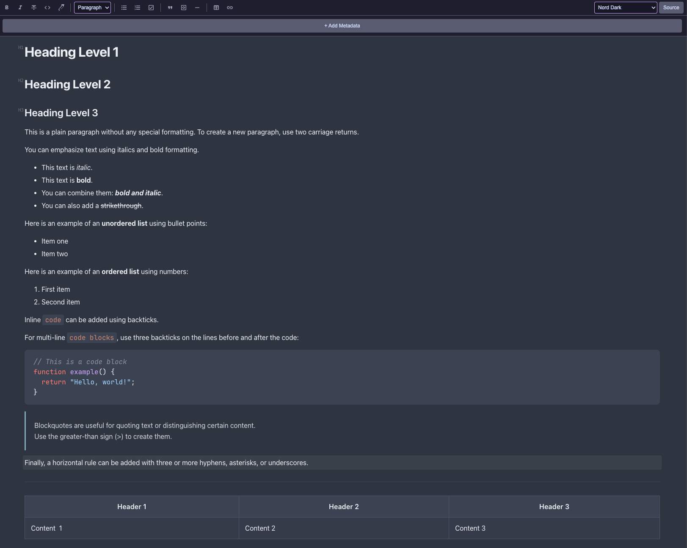

# TUI Markdown Editor

A beautiful WYSIWYG Markdown editor for VS Code powered by Tiptap.

## Features

- **Rich Text Editing**: WYSIWYG markdown editing powered by Tiptap + `@tiptap/markdown` (MarkedJS parser, GFM support)
- **Syntax Highlighting**: Code blocks with language-aware highlighting via lowlight (19 languages)
- **Code Block Header**: Language badge with dropdown selector and copy-to-clipboard button
- **Mermaid Diagrams**: Live SVG preview for `mermaid` code blocks with view/edit mode toggle, theme sync, caching, fullscreen lightbox (zoom/pan), and copy-as-PNG button (2x retina) on preview + in lightbox toolbar
- **GitHub-Style Alerts**: `[!NOTE]`, `[!TIP]`, `[!IMPORTANT]`, `[!WARNING]`, `[!CAUTION]` render as color-coded alert boxes
- **Task Lists**: Checkbox support with nested task items
- **Table Editing**: Resizable tables with multi-line cell content (lists, breaks) preserved in markdown
- **Table Context Menu**: Right-click on table cells for select/add/delete row/column/table actions
- **Cell Selection Highlight**: Drag-selecting across table cells shows visual highlight overlay
- **Content Zoom**: Zoom editor content 50%–200% via Appearance popover or Ctrl/Cmd +/-/0 shortcuts
- **Appearance Popover**: Consolidated zoom, theme, and font controls behind a single gear icon
- **Theme Selection**: 12 editor themes including Catppuccin (4 variants), Paper (warm serif), Midnight (deep navy)
- **Image Lightbox**: Fullscreen image viewer with zoom controls (0.5x–4x), expand button on hover
- **Search (Cmd+F)**: Find text in editor with match highlighting, next/prev navigation, and match counter
- **Link Navigation**: Cmd+Click (macOS) / Ctrl+Click (Windows/Linux) to follow links — scroll to headings, open files, or launch URLs
- **View Source**: Toggle between WYSIWYG and source view (Ctrl/Cmd+Shift+M)
- **Cursor Line Highlight**: Visual highlight of current block/paragraph
- **Table of Contents**: Sidebar with click-to-scroll, active heading tracking, and collapse/expand
- **Heading Level Badges**: H1-H6 indicators next to headings
- **Heading Collapse/Expand**: Toggle arrows on headings to collapse/expand content sections
- **Metadata Panel**: Collapsible YAML frontmatter editor with validation
- **Image Upload**: Paste images from clipboard or drag-and-drop into editor
- **Image URL Editing**: Double-click on image to edit URL/path
- **Auto-link Paste**: Paste URL on selected text to create markdown link
- **Auto Rename Images**: Rename image files when you change the path in markdown
- **Auto Delete Images**: Delete image files when removed from markdown (moves to Trash)
- **Local Image Display**: Renders local images from document folder and workspace
- **Tab Indentation**: Tab key inserts 2-space indentation inside code blocks
- **Large File Warning**: Protection for files >500KB
- **Font Selector**: Searchable font picker on toolbar — browse all system fonts with live preview
- **Reading Progress Bar**: Fixed top bar tracking scroll position
- **Word Count**: Subtle indicator in bottom-right corner
- **Toolbar Auto-hide**: Opt-in auto-hide after 3s of inactivity, reveal on hover
- **Export to DOCX**: One-click export to Word `.docx` via `mdast2docx`. Preserves headings, lists, tables, code blocks, and images (inline mermaid diagrams rendered as PNG). Respects the active editor font.
- **Export to PDF**: WYSIWYG export via headless Chromium (`puppeteer-core`). Requires Chrome, Edge, Chromium, or Brave installed locally (not bundled). Auto-detects common install paths; override with `tuiMarkdown.chromiumPath` if needed.
- **Configurable Font Size**: Adjust editor font size (8-32px)
- **Configurable Heading Sizes**: Customize font sizes for H1-H6 headings (12-72px)

## Usage

1. Open any `.md` or `.markdown` file
2. Editor opens automatically in WYSIWYG mode
3. Use toolbar to format text and insert elements
4. Changes save automatically to source file

## Configuration

| Setting | Default | Description |
|---------|---------|-------------|
| `tuiMarkdown.fontSize` | 16 | Editor font size (8-32px) |
| `tuiMarkdown.highlightCurrentLine` | true | Enable cursor line highlight |
| `tuiMarkdown.imageSaveFolder` | `images` | Folder to save pasted images (relative to document) |
| `tuiMarkdown.autoRenameImages` | true | Auto rename image files when path changes in markdown |
| `tuiMarkdown.autoDeleteImages` | true | Auto delete image files when removed from markdown (moves to Trash) |
| `tuiMarkdown.autoHideToolbar` | false | Auto-hide toolbar when typing (show on hover) |
| `tuiMarkdown.chromiumPath` | `""` | Absolute path to a Chrome/Edge/Chromium/Brave executable for PDF export. Leave empty to auto-detect. |
| `tuiMarkdown.headingSizes.h1` | 32 | H1 heading font size (12-72px) |
| `tuiMarkdown.headingSizes.h2` | 28 | H2 heading font size (12-72px) |
| `tuiMarkdown.headingSizes.h3` | 24 | H3 heading font size (12-72px) |
| `tuiMarkdown.headingSizes.h4` | 20 | H4 heading font size (12-72px) |
| `tuiMarkdown.headingSizes.h5` | 18 | H5 heading font size (12-72px) |
| `tuiMarkdown.headingSizes.h6` | 16 | H6 heading font size (12-72px) |

## Themes

| Theme | Style |
|-------|-------|
| Frame | Light |
| Frame Dark | Dark |
| Nord | Light |
| Nord Dark | Dark |
| Crepe | Light |
| Crepe Dark | Dark |
| Catppuccin Latte | Light |
| Catppuccin Frappé | Dark |
| Catppuccin Macchiato | Dark |
| Catppuccin Mocha | Dark |
| Paper | Light |
| Midnight | Dark |

## Requirements

- VS Code 1.85.0 or higher

## Release Notes

See [CHANGELOG.md](CHANGELOG.md) for version history.

## License

MIT
