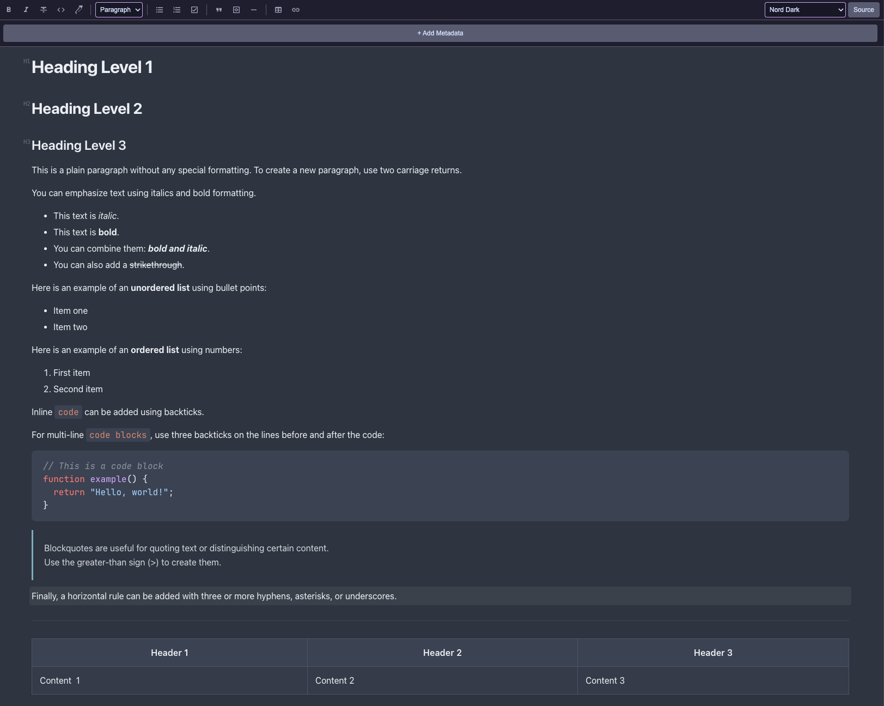

  

  # TUI Markdown Editor

  *A beautiful WYSIWYG Markdown editor for VS Code, powered by Tiptap*

  
  
  

  [Features](#features) · [Usage](#usage) · [Configuration](#configuration) · [Themes](#themes) · [Export](#export)

## Features

### Rich Text Editing

Full WYSIWYG markdown editing with Tiptap + `@tiptap/markdown` (GFM support via MarkedJS). Format text using the glassmorphic toolbar or keyboard shortcuts, including underline with `Ctrl/Cmd+U`, which is saved as `<ins>text</ins>` so it still renders underlined on GitHub and in the VS Code preview. `Ctrl/Cmd+Shift+M` toggles between WYSIWYG and source view in both directions.

- **Slash Commands**: type `/` at the start of an empty line for a filtered list of blocks to insert (headings, lists, table, code block, Mermaid diagram, the five GitHub alerts, image, quote, horizontal rule)
- **Selection Bubble Menu**: Bold, Italic, Code, Link and Highlight appear where you selected text
- **Inline Link Editor**: editing a link happens in a popover at the cursor, not in a dialog at the top of the window
- **Emoji Picker**: type `:` for fuzzy-filtered emoji; the character is inserted as unicode, so the file keeps what you would have typed by hand
- **Drag Handle**: hover a block and drag it to reorder

### Code & Diagrams

- **Syntax Highlighting** — 19 languages via lowlight, with language badge dropdown and copy button
- **Mermaid Diagrams** — Live SVG preview with view/edit toggle, theme sync, fullscreen lightbox (zoom/pan), and copy-as-PNG (2x retina)
- **GitHub Alerts** — `[!NOTE]`, `[!TIP]`, `[!IMPORTANT]`, `[!WARNING]`, `[!CAUTION]` render as styled alert boxes
- **Math**: `$inline$` and `$$block$$` formulas render with KaTeX; the source on disk stays plain `$...$`
- **Line Numbers and Wrap**: per code block, from the block header
- **HTML that renders**: `
`/`
` collapse as they do on GitHub, and `<kbd>`, ``, `` render as themselves

### Tables

Resizable tables with multi-line cell content. Right-click context menu for row/column operations, including column alignment (left, center, right), and fully operable from the keyboard with Tab, the arrow keys, Enter and Escape. Drag-select cells with visual highlight overlay.

### Images

- Paste from clipboard or drag-and-drop (auto-saved to configurable folder)
- Double-click to edit URL/path
- Auto-rename files when path changes in markdown
- Auto-delete files when removed from markdown (moves to Trash)
- Drag a corner handle to resize, saved as `` so the size survives a roundtrip
- Fullscreen lightbox with zoom controls (0.5x to 4x), keyboard operable: focus is trapped while it is open and returns to the image when it closes
- Open local image file in a new VSCode editor tab (hover button; works with Excalidraw plugin for `.svg`)

### Navigation & Search

- **Search and Replace** (`Cmd/Ctrl+F`): find with match highlighting, next/prev navigation and a match counter; the replace row adds replace, replace all and a case-sensitive toggle
- **Link Navigation** — `Cmd+Click` / `Ctrl+Click` to follow links, scroll to headings, open files, or launch URLs
- **Table of Contents** — Sidebar with click-to-scroll, active heading tracking, collapse/expand
- **Backlinks**: panel listing every workspace document that links here through `[[wiki links]]` or `@` mentions; click one to open it
- **Wiki Links** — Type `[[` for autocomplete over the workspace's Markdown files; `[[Page]]` links resolve on click, and following one that does not exist offers to create it next to the current document
- **File Mentions** — Type `@` to search any file in the workspace and insert a relative link

### Writing Experience

- **Content Zoom** — 50%–200% via Appearance popover or `Ctrl/Cmd +/-/0`
- **Font Selector** — Browse all system fonts with live preview
- **Cursor Line Highlight** — Visual highlight of current block
- **Heading Collapse** — Toggle arrows on headings to collapse/expand sections
- **Metadata Panel** — Collapsible YAML frontmatter editor with validation
- **Reading Progress Bar** — Fixed top bar tracking scroll position
- **Word Count and Reading Time** — Subtle indicator in bottom-right corner
- **File Mention (@)** — Type `@` to autocomplete workspace filenames, inserts markdown link
- **Toolbar Auto-hide** — Opt-in, reveals on hover
- **Focus Mode**: hides the toolbar, table of contents and progress bar, and keeps the line you are typing centred
- **Footnotes**: `[^1]` references are numbered, and hovering one previews its definition

## Usage

1. Install from [VS Code Marketplace](https://marketplace.visualstudio.com/)
2. Open any `.md` or `.markdown` file
3. Editor opens automatically in WYSIWYG mode
4. Use toolbar to format text and insert elements
5. Changes save automatically to source file

### Choosing which editor opens Markdown

This extension registers itself as the default editor for `.md` and `.markdown`,
so those files open in WYSIWYG mode everywhere. If you would rather a particular
workspace opened them as plain text, for instance because a Git tool opens `.md`
diffs there, run **Choose Default Editor for Markdown in this Workspace** from the
Command Palette. It offers three choices, and each one is reversible from the same
entry:

- **TUI Markdown (WYSIWYG)**, the rich editor
- **Text editor (raw markdown)**, VS Code's built-in editor
- **Reset to the extension default**, which removes the workspace setting again

The choice is written to `workbench.editorAssociations` in the workspace settings,
so it travels with the folder and not with your user profile.

## Export

### Export to DOCX

One-click export to Word `.docx` via `mdast2docx`. Preserves headings, lists, tables, code blocks, and images (mermaid diagrams rendered as PNG). Respects the active editor font.

### Export to PDF

WYSIWYG export via headless Chromium (`puppeteer-core`). Requires Chrome, Edge, Chromium, or Brave installed locally (not bundled). Auto-detects common install paths.

> [!TIP]
> If auto-detection fails, set `tuiMarkdown.chromiumPath` in VS Code settings to the absolute path of your browser executable.

## Configuration

| Setting | Default | Description |
|---------|---------|-------------|
| `tuiMarkdown.fontSize` | `16` | Editor font size (8–32px) |
| `tuiMarkdown.highlightCurrentLine` | `true` | Enable cursor line highlight |
| `tuiMarkdown.imageSaveFolder` | `images` | Folder for pasted images (relative to document) |
| `tuiMarkdown.autoRenameImages` | `true` | Auto-rename image files when path changes |
| `tuiMarkdown.autoDeleteImages` | `true` | Auto-delete images removed from markdown (Trash) |
| `tuiMarkdown.autoHideToolbar` | `false` | Auto-hide toolbar when typing |
| `tuiMarkdown.listIndent` | `"editor"` | List and code block indent: `editor` follows VS Code, or `2`, `4`, `tab` |
| `tuiMarkdown.chromiumPath` | `""` | Chrome/Chromium path for PDF export |
| `tuiMarkdown.exportPageSize` | `A4` | Page size for PDF/DOCX export (`A4` or `Letter`) |
| `tuiMarkdown.headingSizes.h1`–`h6` | `32`–`16` | Heading font sizes (12–72px) |

## Themes

12 built-in themes with curated typography and color palettes:

| Theme | Style | Character |
|-------|-------|-----------|
| Frame | Light | Clean, modern default |
| Frame Dark | Dark | Blue-tinted, sharp |
| Nord | Light | Soft Arctic palette |
| Nord Dark | Dark | Official Nord colors |
| Crepe | Light | Warm serif reading |
| Crepe Dark | Dark | Warm serif, inverted |
| Catppuccin Latte | Light | Pastel warmth |
| Catppuccin Frappé | Dark | Subdued, muted |
| Catppuccin Macchiato | Dark | Medium contrast |
| Catppuccin Mocha | Dark | Rich, deep |
| Paper | Light | Serif, book-like |
| Midnight | Dark | Deep navy (#0d1117) |

## Tech Stack

| Layer | Technology |
|-------|-----------|
| Editor engine | [Tiptap 3](https://tiptap.dev) + `@tiptap/markdown` |
| Markdown parser | MarkedJS (GFM) via `@tiptap/markdown` |
| Syntax highlighting | [lowlight](https://github.com/wooorm/lowlight) (highlight.js) |
| Diagrams | [Mermaid 11](https://mermaid.js.org) + ELK layout |
| DOCX export | [mdast2docx](https://github.com/nicolo-ribaudo/mdast2docx) + @m2d plugins |
| PDF export | [puppeteer-core](https://pptr.dev) + remark/rehype pipeline |
| Build | esbuild |

## Requirements

- VS Code 1.85.0 or higher
- For PDF export: Chrome, Edge, Chromium, or Brave installed on the system
