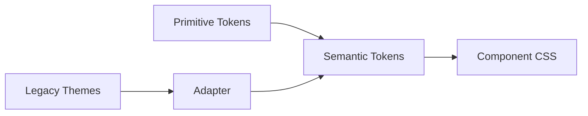

# Premium Showcase

Fixture dùng để smoke test mọi element. Mở file này trong editor với từng theme để verify.

## Heading 2: Typography Scale

### Heading 3: Sub-section

#### Heading 4: Detail

##### Heading 5: Fine print

###### Heading 6: Smallest

Body text with **bold**, *italic*, ~~strikethrough~~, `inline code`, and ==highlighted text==.

A paragraph with a [link to somewhere](https://example.com) and a longer sentence to test line wrapping at the prose width boundary which should be around 72 characters wide.

## Lists

- Bullet item one
- Bullet item two
  - Nested bullet
  - Another nested
- Bullet item three

1. Ordered item one
2. Ordered item two
3. Ordered item three

- [x] Completed task
- [ ] Pending task
- [ ] Another pending task

## Blockquote

> This is a blockquote. It should have a subtle left border that thickens on hover.
>
> Second paragraph in blockquote.

## Code

Inline `code` looks different from code blocks:

```javascript
function greet(name) {
  const message = `Hello, ${name}!`;
  console.log(message);
  return message;
}
```

```python
def fibonacci(n: int) -> list[int]:
    """Generate fibonacci sequence."""
    seq = [0, 1]
    for i in range(2, n):
        seq.append(seq[-1] + seq[-2])
    return seq
```

```css
.glass-popover {
  background: var(--surface-overlay);
  backdrop-filter: blur(16px) saturate(180%);
  border: 1px solid var(--border-subtle);
}
```

## Table

| Feature | Status | Priority |
|---------|--------|----------|
| Token system | Done | High |
| Legacy refresh | In progress | High |
| Soft Modular | Planned | Medium |
| Component sweep | Planned | Medium |
| Polish | Planned | Low |

## Images


## Alerts

> [!NOTE]
> This is a note alert. Provides additional context.

> [!TIP]
> This is a tip alert. Helpful advice for the reader.

> [!IMPORTANT]
> This is an important alert. Critical information.

> [!WARNING]
> This is a warning alert. Potential issues ahead.

> [!CAUTION]
> This is a caution alert. Dangerous action.

## Horizontal Rule

---

## Footnote

This sentence has a footnote[^1].

[^1]: This is the footnote content.

## Diagram


