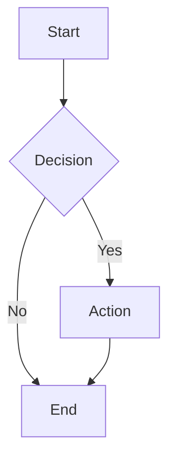
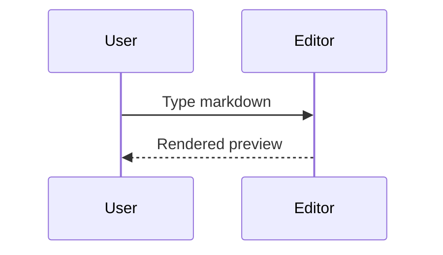

```mermaid
flowchart TD
    A[Start] --> B{Decision}
    B -->|Yes| C[Action]
    B -->|No| D[End]
    C --> D
```

Text between two diagrams.

```mermaid
sequenceDiagram
    participant User
    participant Editor
    User->>Editor: Type markdown
    Editor-->>User: Rendered preview
```

Trailing paragraph after the last diagram.