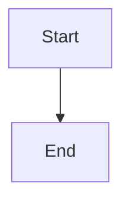

# Heading One

Some **bold** text and a [link](https://example.com).

| Column A | Column B |
| -------- | -------- |
| 1        | 2        |
| 3        | 4        |

- [ ] an unchecked task
- [x] a checked task

```js
const answer = 42;
```



> [!NOTE]
> An alert block.


Inline math $\frac{a}{b}$ and a formula block follow. Press <kbd>Ctrl</kbd> to run.

$$
\int_0^1 x^2 dx
$$

<details>
<summary>More</summary>

Hidden body.

</details>

A sentence with a footnote reference[^floor].

[^floor]: The footnote body the hover preview must show.
