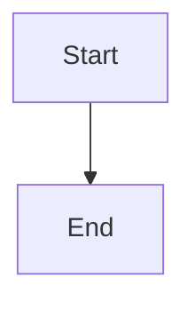

# Heading One

Some **bold** text and a [link](https://example.com).

| Column A | Column B |
| -------- | -------- |
| 1        | 2        |
| 3        | 4        |

- [ ] an unchecked task
- [x] a checked task

```js
const answer = 42;
```



> [!NOTE]
> An alert block.
